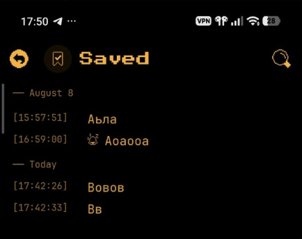
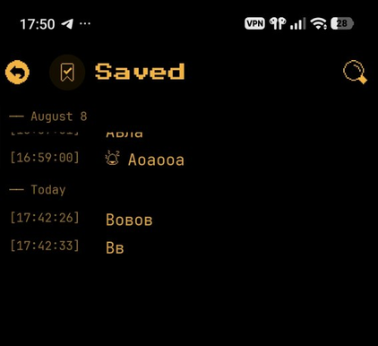

# [UI] При открытой клавиатуре нельзя проскроллить к сообщениям прошлых дней

**Дата:** 2026-08-10  
**Модуль:** `src/pages/chat-room/ChatRoomScreen.tsx`, `src/shared/lib/keyboard.ts`, `src/pages/chat-room/scrollEdge.ts`  
**Платформа:** Android  
**Приоритет:** P1  
**Воспроизводимость:** высокая  
**Статус:** fixed (2026-08-10, вторая итерация)

## Описание

В чате при свёрнутой клавиатуре история сообщений доступна: можно проскроллить вверх и увидеть сообщения прошлых дней (например, «— August 8 —»).

Когда клавиатура развёрнута, область списка сжимается, но проскроллить до сообщений прошлых дней нельзя — они «обрезаны» / недоступны для просмотра. Сообщения текущего дня при этом видны.

## Скриншоты

| Состояние | Файл |
|-----------|------|
| Клавиатура свёрнута — история прошлых дней видна | [`assets/chat-scroll-keyboard-collapsed.png`](./assets/chat-scroll-keyboard-collapsed.png) |
| Клавиатура развёрнута — к прошлым дням не проскроллить | [`assets/chat-scroll-keyboard-expanded.png`](./assets/chat-scroll-keyboard-expanded.png) |

## Шаги воспроизведения

1. Открыть чат с историей за несколько дней (например, Saved).
2. Убедиться, что клавиатура свёрнута: проскроллить вверх — видны сообщения прошлых дней (разделитель «— August 8 —» и т.п.).
3. Тапнуть по полю ввода → клавиатура разворачивается.
4. Попытаться проскроллить список сообщений вверх к прошлым дням.

## Ожидаемый результат

При открытой клавиатуре список сообщений остаётся полностью прокручиваемым: можно дойти до самых старых сообщений (в т.ч. прошлых дней).

## Фактический результат

При развёрнутой клавиатуре проскроллить до сообщений прошлых дней нельзя — ранняя история недоступна для просмотра, хотя при свёрнутой клавиатуре она есть.

## Корневая причина

На Android с `adjustNothing` подъём композера делался через `useAnimatedStyle` → `paddingBottom` на `chatArea` (Reanimated, UI-поток).

1. Родитель визуально «сжимался» / клипил список через `overflow: hidden`, но Yoga/`onLayout` у `AnimatedFlatList` не обновлялись надёжно.
2. `historyCanScroll` оставался `false` (контент «влезал» в старый viewport) → `scrollEnabled={false}` и `contentContainerStyle` с `flexGrow: 1`.
3. Верх ленты (сообщения прошлых дней) оказывался за клипом; скроллить было некуда (`maxOffset ≈ 0`).

## Попытка 1 (не сработала)

Только `scrollEnabled={historyCanScroll || keyboardOpen}` (и `pointerEvents`).  
`flexGrow: 1` и Reanimated-padding остались → нативный список не получал реальный меньший layout, скроллить по-прежнему было некуда.

## Исправление (итерация 2)

- **Android:** `paddingBottom` на `chatArea` из React state (`androidKeyboardPad` / `getAndroidChatAreaKeyboardPad`) по `keyboardDidShow`/`Hide` — обычный Yoga-relayout, `onLayout` срабатывает. iOS не трогаем (`paddingBottom` только при `Platform.OS === 'android'`).
- Убран Reanimated `paddingBottom` с `chatArea`.
- `shouldEnableHistoryListScroll`: на Android при открытой клавиатуре включаем скролл и **снимаем** `flexGrow: 1` с `contentContainerStyle` (не только `scrollEnabled`).
- iOS: поведение как раньше — gate только по `historyCanScroll`.

Связанные баги: `chat-last-message-hidden-behind-composer.md`, `chat-keyboard-gap-*.md`, `keyboard-covers-input-android.md`, `chat-input-keyboard-dismisses-after-focus.md`.
