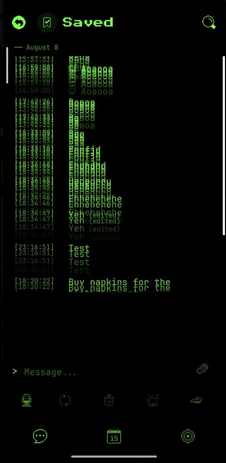

# [UI] Бесконечное колебание анимации сообщений при открытии/закрытии клавиатуры

**Дата обнаружения:** 2026-08-12  
**Статус:** fixed (2026-08-12)  
**Платформа:** Android (вероятнее всего; экран чата с ручным keyboard pad)

## Описание

На экране чата при открытии и закрытии клавиатуры список сообщений может войти в **бесконечный быстрый цикл** анимации: строки резко и непрерывно «дрожат» вверх-вниз (ghosting / trail из нескольких копий одной и той же строки). UI становится нечитаемым, пока не уйти с экрана.

Скриншот симптома:

## Шаги воспроизведения

1. Открыть чат с несколькими сообщениями (например Saved).
2. Сфокусировать поле ввода → открыть клавиатуру.
3. Закрыть клавиатуру (back / тап вне поля) и снова открыть; при необходимости повторить несколько раз.
4. Наблюдать список сообщений.

## Ожидаемый результат

Сообщения остаются на месте (или один раз спокойно «прилипают» к низу при shrink viewport). Повторного `FadeInUp` / layout-spring по всему списку нет.

## Фактический результат

Сообщения начинают бесконечно и очень быстро колебаться вверх-вниз; на кадре видно вертикальный trail из дублей timestamp + текста.

## Когда срабатывает анимация (нормально)

В `MessageLine` две Reanimated-анимации:

| Анимация | Когда должна срабатывать |
|----------|---------------------------|
| `entering={FadeInUp.springify()}` | При **монтировании** строки: новое сообщение или remount ячейки |
| `layout={Layout.springify()}` | Когда у уже смонтированной строки **меняется layout-позиция** |
| `exiting={FadeOutDown}` | При размонтировании строки (удаление) |

## Причина

1. `keyboardOpen` **переключал целое дерево** списка (две ветки с отдельным `AnimatedFlatList`) → remount всех `MessageLine` → массовый `FadeInUp`.
2. Параллельно `androidKeyboardPad` + `scrollToEnd` + `layout={Layout.springify()}` давали feedback loop spring-анимаций.

## Исправление

1. **Один FlatList** — `GestureDetector` всегда в дереве; при открытой клавиатуре жест = инертный `Gesture.Manual()` (не peek-Pan), чтобы не есть вертикальный скролл на Android.
2. **Гейт анимаций** — `animateEnter` только для ключей, которые ещё не анимировали (Set в `ChatRoomScreen`); `animateLayout` выключен пока `keyboardOpen`.
3. **`scrollToEnd` на show** — без `animated: true`.
4. **`shouldEnableHistoryListScroll`** — снова используется для scrollEnabled при клавиатуре на Android.

### Изменённые файлы
- `src/pages/chat-room/ChatRoomScreen.tsx`
- `src/pages/chat-room/MessageLine.tsx`
- `src/pages/chat-room/DateSeparator.tsx`
- `src/pages/chat-room/__tests__/ChatRoomScreen.keyboardFocus.test.tsx`
- `src/pages/chat-room/__tests__/MessageLine.test.tsx`

## Проверка

Saved → открыть/закрыть клавиатуру несколько раз → список не должен «дрожать». Скролл к старым сообщениям при открытой клавиатуре на Android должен сохраниться.
